# Interstellar Pairs

[View the live project here](https://sbi-code.github.io/memory-game/)

This is the website for Interstellar Pairs memory game. It is a space themed memory game and is designed to be responsive and accessible on a range of devices, allowing users to navigate the site easily.

External user’s goal:

- The player aims to test and improve their memory by matching pairs of cards as quickly as possible before the timer runs out. They must recall card positions, think strategically, and make quick decisions to clear the board efficiently. The ultimate goal is to complete the game in the shortest time possible and achieve the highest score.

Site owner's goal:

- To design an engaging and fast-paced memory game that challenges players’ recall and cognitive speed. The game should provide an intuitive and enjoyable experience with smooth mechanics, visually appealing design, and balanced difficulty. By incorporating a timer, the creator aims to add excitement and replay ability, encouraging players to improve their skills and compete for better times.

Core gameplay features:
- Card matching mechanic: Players flip two cards at a time to find matching pairs.
- Timer: A countdown clock adds urgency and challenge.
- Scoring system: Points awarded based on number of cards successfully matched.

Engagement and replay ability:
- Sound feedback: Satisfying sound effects when matching or making mistakes.
- Messaging: Winner and game over messages displayed at the end of the game.

Accessibility and UX:
- Multi-screen play – Available on mobile, web, and desktop.
- Touch and click controls – Smooth interactions for different devices.

## Responsive
[Am I Responsive](https://ui.dev/amiresponsive) was used to check if the site is responsive:

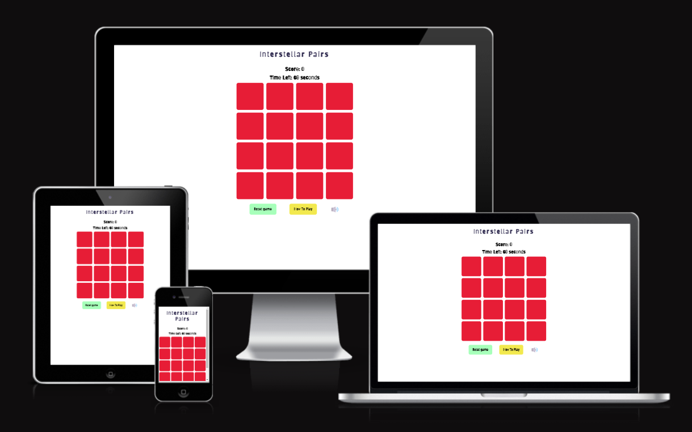

## User Experience (UX)

### User Stories

#### User Story 1: Starting a game (must-have)
As a player, I want to start a new memory game so that I can begin matching pairs.
#### Acceptance Criteria:
- A way to start the game is available either through a button or by flipping a card.
- The game board initializes with shuffled cards.
- The timer starts as soon as the game begins.
- The game displays the current time and score.
#### Tasks:
- Design the functionality to start the game on the first card click.
- Randomly shuffle and display the cards on the board.
- Implement the countdown timer.
- Display real-time updates for time and score.

#### User Story 2: Flipping cards (must-have)
As a player, I want to flip two cards at a time so that I can find matching pairs.
#### Acceptance Criteria:
- Players can click/tap a card to flip it.
- Only two cards can be flipped at a time.
- Cards flip back if they don’t match after a short delay.
- Matched pairs remain face-up.
#### Tasks:
- Implement click/tap functionality for flipping cards.
- Ensure only two cards can be selected at once.
- Add a delay before flipping unmatched cards back.
- Lock matched cards in place.

#### User Story 3: Winning the game (must-have)
As a player, I want to win the game by matching all pairs before the timer runs out.
#### Acceptance Criteria:
- The game ends when all pairs are matched.
- A victory message is displayed along with a sound effect.
- The player’s time is paused and score is visible.
- A "Play Again" button appears.
#### Tasks:
- Track the number of matched pairs.
- Detect when all pairs have been found.
- Display a victory screen with score and timer seen in background.
- Implement a "Play Again" button.

#### User Story 4: Losing the game (must-have)
As a player, I want to know when time runs out so that I can try again.
#### Acceptance Criteria:
- The timer counts down to zero.
- When time runs out, the game displays a "Game Over" message with a sound effect.
- The player can restart the game.
#### Tasks:
- Implement a countdown timer that ends the game at zero.
- Display a "Game Over" message when the timer expires.
- Offer a "Try Again" button.

#### User Story 5: Instructions (must-have)
As a new player, I want to see simple instructions on how to play so that I understand the game mechanics.
#### Acceptance Criteria:
- The game displays a "How to Play" button.
- Instructions are clear, concise, and beginner-friendly (covering matching pairs, time limit, and scoring).
- The instructions appear on the main menu or a separate modal/pop-up before the game begins.
- A "Close" button allows players to dismiss the instructions and start the game.
- Instructions can be accessed again from a help button or menu during gameplay.
#### Tasks:
- Write clear, concise instructions explaining:
- The goal (match all pairs before the timer runs out).
- How to flip cards.
- How scoring and the timer work.
- Tips to help players
- Create an instructions modal/pop-up that appears when button is clicked.
- Add an “X” close button to dismiss the instructions and allow users to click outside the container to close the modal without starting the game.
- Allow the “How to play” button to be available during gameplay to reopen the instructions.

#### User Story 6: Scoring system (should-have)
As a player, I want to earn points based on my performance so that I can track my progress.
#### Acceptance Criteria:
- Score increases for each correct match.
- A final score is displayed at the end of the game.
#### Tasks:
- Define scoring rules (e.g., points per match).
- Update and display the score dynamically.
- Show the final score on the results screen.

#### User Story 7: Difficulty levels (could-have)
As a player, I want to choose different difficulty levels so that I can challenge myself.
#### Acceptance Criteria:
- The game offers multiple difficulty levels (e.g., Easy, Medium, Hard).
- Each level has a different grid size (e.g., 4x4, 6x6, 8x8).
- Higher difficulty levels have a shorter timer.
#### Tasks:
- Design a difficulty selection screen.
- Adjust the board size and timer based on difficulty.
- Ensure the game logic supports different grid sizes.

#### User Story 8: Leaderboard and high scores (could-have)
As a returning player, I want to see my high scores so that I can track my progress and compete.
#### Acceptance Criteria:
- The game saves the highest scores.
- A leaderboard displays the top scores.
#### Tasks:
- Implement a local high score storage system.
- Display a leaderboard with names and scores.

#### User Story 9: Two player mode (could-have)
I want to play against another person in a two-player mode, so that I can compete with my friend in real-time.
#### Acceptance criteria 
- The game must allow two players to join and play alternately.
- Players should take turns flipping two cards.
- If a player finds a match, they get a point and can continue their turn.
- If a player does not find a match, the turn switches to the other player.
- The game should indicate whose turn it is.
- The game ends when all pairs have been found.
- The player with the most pairs at the end wins.
- If both players have the same number of pairs, the game ends in a tie.
#### Tasks: 
- Implement turn-based mechanics for two players.
- Allow each player to flip two cards per turn.
- Check if the two flipped cards match: If they match, the player earns a point and keeps their turn. If they don’t match, the cards flip back, and the turn switches.
- Keep track of each player’s score.
- Implement a game-over condition when all pairs are found.
- Display the winner or a tie message.
- Design UI to display player turns.
- Add visual indicators for Player 1 and Player 2.

### Design

#### Color Scheme

The main colors that are used throughout the website pages are; #2E294E, #ffffff, #000000, #F2E94E, #28a745 and #E71D36.
I used [coolors.co](https://coolors.co/) to generate colors for me to choose from.

#### Typography

- The Barriecito and Roboto fonts are used throughout the website with Sans Serif as the fallback font in case for any reason the chosen fonts aren't being imported correctly to the site. Barriecito is playful and fun making it well suited to the genre of the site for headings and buttons.
  Roboto is clear and well structures making it well suited for the “How to play” instructions text.

#### Emojis

- The emojis used are relevant to the sites purpose and theme and are intended to attract the users attention.
- [getemoji](https://getemoji.com/) emojis were used for the game grid, in the instructions text, and for the speaker/ mute toggle. 

### Wireframes

When designing and planning content positioning for the website I used wireframe to plot the layout for the page on mobile, tablet, laptop and bigger screens.
The following displays the different interfaces for mobile, tablet and desktop.
Mobile screens from 280px

Tablet screens from 768px

Desktop screens from 1200px

## Features

### Game Page

#### Responsive on all device sizes, including mobile, tablet and desktop. 

- On mobiles the headers, game grid, how to play and mute toggle buttons are set to fit the page utilizing all available screen space. 
- On tablets all aspects of the site increase to better suit the larger screen. 
- On laptops and desktops all aspects increase further to cater for the increased screen sizes. 

### Gameboard

- This is the main area of the site it features 16 cards. Players click on a card and it flips 180 degrees to reveal the emoji hiding behind. This provides the surface for players to continue to flip the cards to try and make all the matches.  
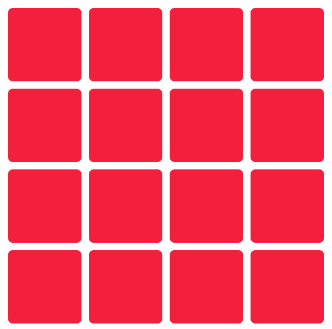

### Sound Effects

- A sound plays if the cards are not matched.
- A sound plays if the cards are matched.
- If all the cards are successfully matched before the timer runs out, a sound is played.
- If the player has failed to match all the cards before the timer runs out, a sound is played.

### The score and timer section 

- When two cards are flipped and they match, one point is awarded. The goal is to get the maximum score before the timer runs out.
- As soon as the first card is flipped the timer starts and counts down from 60 seconds to zero.
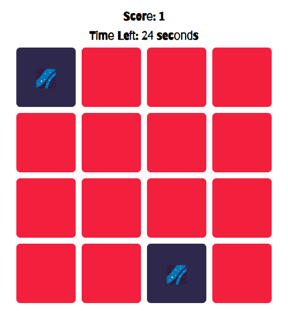

### The reset game button

- The reset game button resets the game board, score and timer if the player wants to play a new game.

### How to play 

- The how to play button is there for players to find out how to best play the game including some tips for success. The modal opens in front of the game grid. Players can either click the "X" in the top right corner of the modal or they can click anywhere else on the page to collapse the modal. 
- 
- 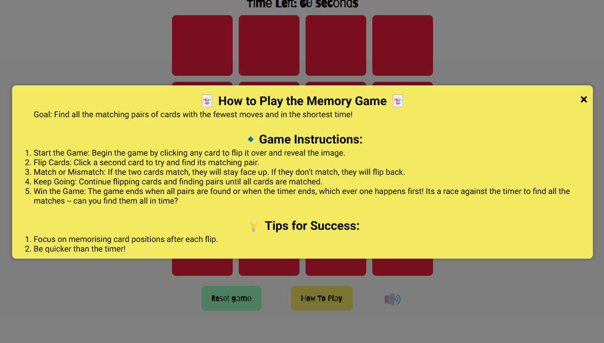

### Sound ON/OFF toggle 

- The speaker icon default is for the sound to be on. It can be clicked to mute all the game play sounds and will show an icon with the speaker crossed out indicating mute mode. 
- 
- 

### Winner modal 

- The winner modal pops up on top of the game grid when all the cards have successfully been matched before the timer reaches zero. It displays a congratulatory message and presents the "Play again" button. 

### Game over modal 

- The game over modal pops up on top of the game grid when the player has not been successful in matching all the cards before the timer reaches zero. It displays a game over message and presents the "Try again" button. 

## Future Features

 In future plans I intend to develop the (could-have) user stories (7, 8 and 9)
- Show the final score and time left in the winner modal and the game over modal. 
- Design a difficulty selection area.
- Adjust the board size based on difficulty level.
- Adjust the timer length based on difficulty level. 
- Implement a local high score storage system.
- Display a leaderboard with names and scores.
- Enable two player game play. 

## Technologies Used

### Languages Used

- [HTML](https://en.wikipedia.org/wiki/HTML) used for the main site content.
- [CSS](https://en.wikipedia.org/wiki/CSS) used for the main site design and layout.
- [JavaScript](https://www.javascript.com/) used for the main site game play and features.

### Frameworks, Libraries & Programs Used

- [CSS Flexbox](https://www.w3schools.com/css/css3_flexbox.asp) and [Flexbox Froggy](https://flexboxfroggy.com/) used for an more responsive layout with enhanced styling.
- [Git](https://git-scm.com) used for version control. (`git add`, `git commit`, `git push`)
- [GitHub](https://github.com) used for secure online project code storage.
- [GitHub Pages](https://pages.github.com) used for hosting the deployed front-end site.
- [Visual Studio Code](https://code.visualstudio.com/) used as a cloud based IDE for development.
- [Google Fonts](https://fonts.google.com/) used to import the 'Barriecito' and 'Roboto' fonts into the style.css file which is used on all pages throughout the project.
- [WAVE tool](https://wave.webaim.org/) used for web accessibility evaluation. 
- [Balsamiq](https://balsamiq.com/) used to create the wireframes during the design process.
- [coolors.co](https://coolors.co/) used to pick the color scheme used throughout the site

## Testing

### W3S HTML Validator
No errors were found when passing through the [HTML W3S validator](https://validator.w3.org/):

### CSS Jigsaw Validator
No errors were found when passing through the [CSS Jigsaw validator](https://jigsaw.w3.org/css-validator):

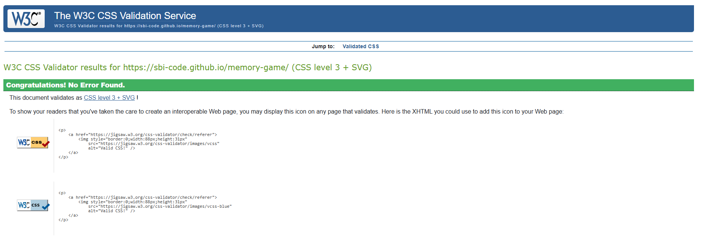

### JavaScript Validator
The code passed through [JShint validator](https://jshint.com/) with one unused variable flagged. It is a false positive for the restartGame variable.

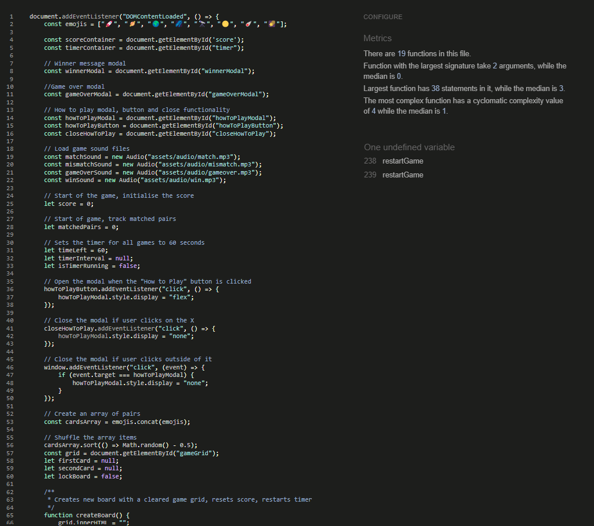

### Lighthouse
Chrome Developer Tools' Lighthouse was used to test the Performance, Accessibility, Best practices and SEO of the website.

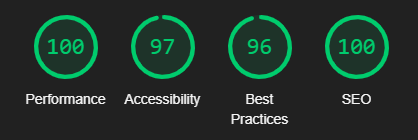

### Browser Compatibility 

I've tested the deployed project on various browsers to check for compatibility issues.

Chrome - Works as expected 

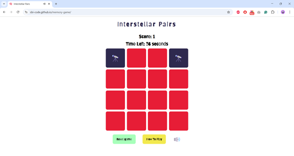

Firefox - Works as expected 

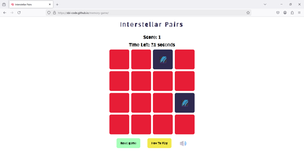

Edge - Works as expected 

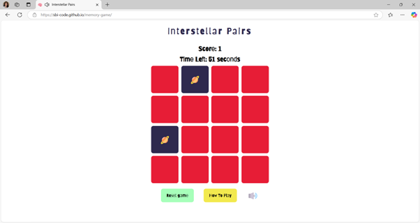

### Responsiveness 

I've tested the deployed project on multiple devices to check for responsiveness issues.

Mobile (DevTools) - Works as expected

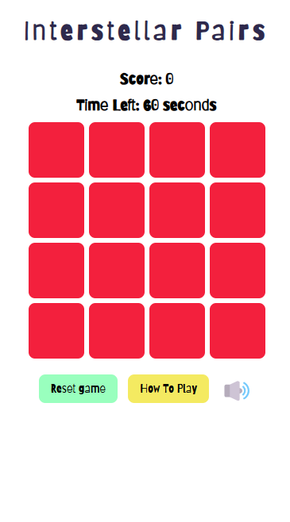

Tablet (DevTools) - Works as expected

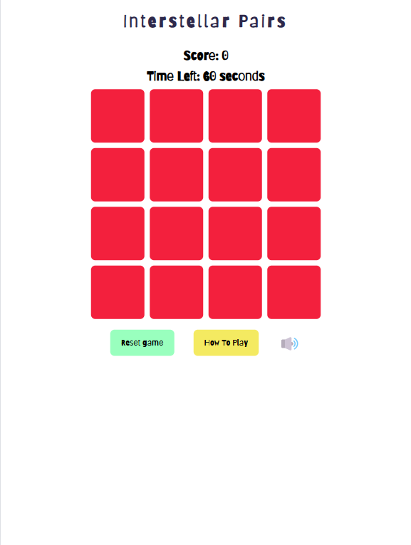

Laptop (DevTools) - Works as expected

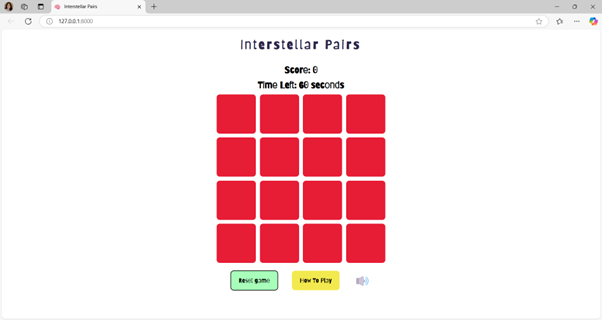

Desktop (DevTools) - Works as expected

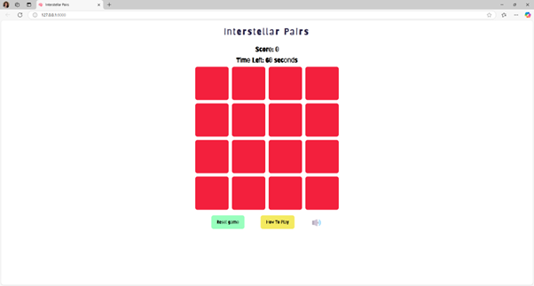

### Solved Bugs
I ran my code through HTML and CSS validation services at various points periodically and used Google Developer Tools to identify and correct style issues. 

#### My process for approaching issues has been as follows, upon identifying an error: 
- I reviewed the course content to go back to first principles see if I could find a solution there. 
- Research online.
- Review slack channels to see if other students ran into the same issue.
- If I spent more that 30 mins with no solution, I would contact tutor support for help and advice which happened once to correct minor errors in flexbox styling. 

- Family members were also asked to review the site and test the responsiveness to find any bugs and/or user experience issues. This led to an extension to the timer which was originally set to 30 seconds.

### User Story Tests 
This testing ensures that the core mechanics work properly and provides fixes for identified issues. Only user stories tagged (Must-Have) and (Should-Have) have been developed so these are the user stories that have been tested below. 

#### User Story 1: Starting a Game (Must-Have)
- Expected: The game should start when the player clicks the start button or flips the first card. The board should initialize with shuffled cards, and the timer should start counting down while displaying real-time updates.
- Testing: Clicked the start button and observed whether the game initialized properly. Also tested starting by flipping a card.
- Result: The game did not start immediately when flipping a card due to an event listener missing on the first click.
- Fix: Added an event listener to the first card click event to trigger game initialization.

#### User Story 2: Flipping Cards (Must-Have)
- Expected: A player can flip two cards at a time. If they match, they stay face-up. If they don’t match, they flip back after a short delay.
- Testing: Clicked on multiple cards to ensure only two flipped at a time. Observed behavior when cards matched and when they did not.
- Result: The feature worked as expected. Cards flipped correctly, matched cards stayed face-up, and non-matching cards flipped back after the delay.
- Fix: No fix needed.

#### User Story 3: Winning the Game (Must-Have)
- Expected: The game should detect when all pairs are matched, stop the timer, display a victory message, and show the final score.
- Testing: Matched all pairs and checked if the game correctly ended with a winner message.
- Result: The victory message did not appear because the condition to check for all matches was not triggered correctly. Also whenever the page was refreshed the winner message would display. 
- Fix: Updated the match-tracking logic to check after every successful pair if all pairs have been found and fixed the placement of the winnerModal.style.display to be in the createBoard function, rather than the restartGame function. 

#### User Story 4: Losing the Game (Must-Have)
- Expected: The timer should count down to zero, and when it reaches zero, a "Game Over" message should appear along with an option to restart the game.
- Testing: Let the timer run out without matching all pairs to observe if the "Game Over" message appeared.
- Result: The timer reached zero, but the game over modal did not display.
- Fix: Edited the CSS to apply the correct flex styling to show the "Game Over" message to display in the correct area of the page.

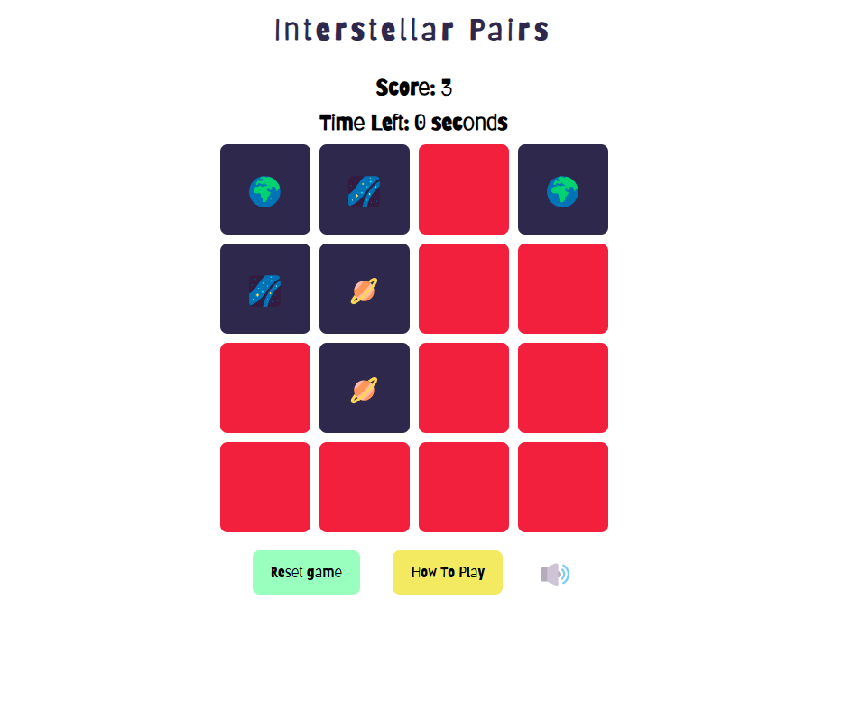

#### User Story 5: Instructions (Must-Have)
- Expected: The game should provide an accessible "How to Play" button that opens a modal with instructions. The player should be able to close the modal and access it again during gameplay.
- Testing: Clicked the "How to Play" button and checked if the instructions appeared in a modal. Tested the close button and reopening the instructions during the game.
- Result: The instructions displayed correctly, but the modal did not close when clicking outside the container. Also the "X" button to close the how to play was stuck top the right side of the container.
- Fix: Added an event listener to close the modal when clicking outside its container. Amended the styling of the close button to set position to absolute.

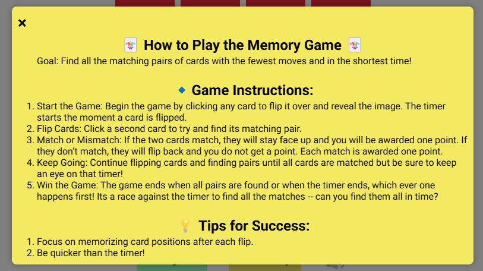

#### User Story 6: Scoring System (Should-Have)
- Expected: A player earns points for each successful match, and the score is updated after each successful match, once the maximum score is reached the winner message should appear.
- Testing: Matched multiple pairs and checked if the score increased correctly till maximum score was reached and waited to see if the winner modal displayed.
- Result: The score updated correctly during the game and the winner message was displayed, however the styling was not correct for the winner message play again button.
- Fix: Modified the CSS for the modal content to correctly use flexbox styling.

#### Sound Effects 
- Expected: Sound effects should play when making a match, failing to match and winning and losing the game.
- Testing: Matched pairs, mismatched pairs, and won/lost the game while checking for sound effects.
- Result: None of the sounds were playing. 
- Fix: Corrected the file paths in the js file to get them to play. 

#### Device Responsiveness  
- Expected: The game should function correctly on different screen sizes, ensuring cards remain tappable and UI elements adjust properly.
- Testing: Played the game on different screen sizes (desktop, tablet, mobile) and checked if everything remained properly aligned.
- Result: On smaller screens, some cards were partially off-screen, making them difficult to tap.
- Fix: Adjusted CSS media queries for a smaller grid layout so that all cards fit properly on smaller screens and adjusted padding on reset game, and how to play buttons so they remain spaced out.

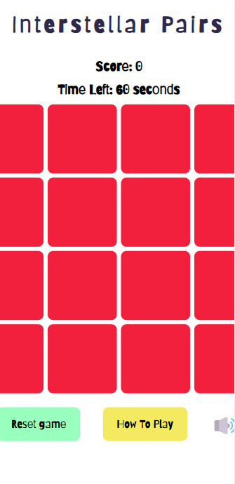

### Unfixed Bugs

There are no active bugs as far as i am aware.

## Deployment

### Version Control

- The repository was created on Github.com and the project was cloned to Visual Studio Code where all the code was added. 
- Git commands were used regularly during the development of the website using the following Git commands;
    - git add .  - to add changes made to files to the staging area before being committed.
    - git commit -m "commit description" - to commit changes to a file to the queue ready for the final command.
    - git push - used to send the committed files to the Github repository.

For my git commits I used the following naming convention to easily identify different types of commit messages; 
- Feature - feat
- Bug fix - fix
- CSS changes - style
- Document changes - docs
- General maintenance - maint

### GitHub Pages

The project was deployed to GitHub Pages using the following steps

1. Log in to GitHub and locate the [GitHub Repository](https://github.com/)
2. At the top of the Repository, locate the "Settings" Button on the menu.
3. Scroll down the Settings page until you find the "GitHub Pages" Section.
4. Under "Source", click the dropdown called "None" and select "Master Branch".
5. Scroll back down through the page to locate the now published site [link](https://github.com) in the "GitHub Pages" section. 
Please click here to find the live site [Interstellar Pairs]( https://sbi-code.github.io/memory-game/)

### Visual Studio Code

I had to switch over from using Gitpod to VS Code due to an institutional decision to make the switch.

1. I followed the tutorials to set up VS Code and all other required installations on my laptop,
2. I created folders for vscode-projects in my folders, 
3. I added folders specific to the memory game,
4. I opened te project folder in VS Code,
5. On GitHub i navigated to my repository and copied the HTTPS URL,
6. Back to VS Code, i then used git clone followed by the copied URL to connect my GitHub repository to VS Code.
7. And finally a quick check to make sure it was all connected by pushing a small change to see if the commit appeared on GitHub.

#### Forking

By forking the GitHub Repository, we make a copy of the original repository on our GitHub account to view and/or make changes without affecting the original owner's repository.
You can fork this repository by using the following steps:

1. Log in to GitHub and locate the [GitHub Repository](https://github.com/SBI-code/memory-game)
2. At the top of the Repository just above the "Settings" Button on the menu, locate the "Fork" Button.
3. Once clicked, you should have a copy of the original repository in your own GitHub account.

## Credits

### Media

| Source | Location | Type | Notes |
| --- | --- | --- | --- |
| [Favicon](https://favicon.io/) | Entire site |image | favicon image |
| [Pixabay](https://pixabay.com/sound-effects/) | Entire site | audio | success |
| [Pixabay](https://pixabay.com/sound-effects/) | Entire site | audio |cartoon fail trumpet |
| [Pixabay](https://pixabay.com/sound-effects/) | Entire site| audio | error |
| [Pixabay](https://pixabay.com/sound-effects/) | Entire site | audio	| success fanfare trumpets |

### Acknowledgements

- My Mentor for his support and continuous helpful feedback.
- Tutor support for providing some learning content on flexbox. 
