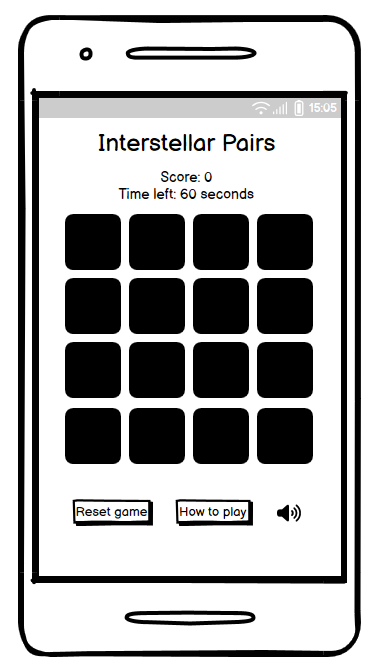
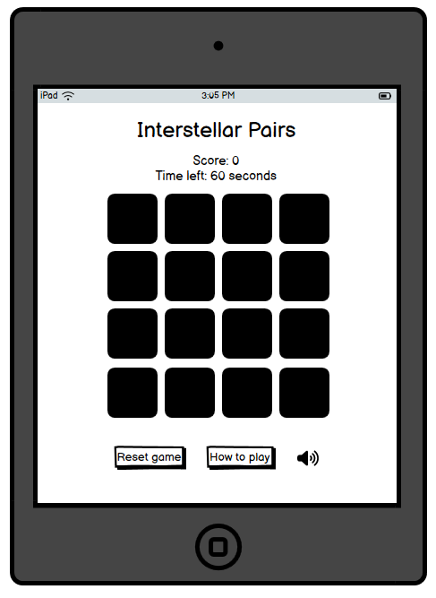
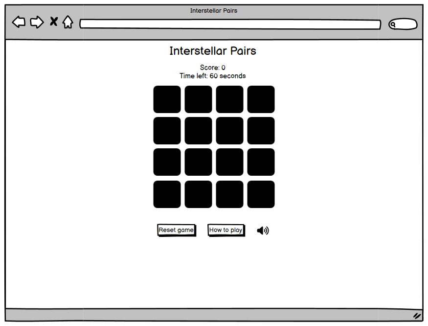

# Interstellar Pairs

[View the live project here](https://sbi-code.github.io/memory-game/)

This is the website for Interstellar Pairs memory game. It is a space themed memory game and is designed to be responsive and accessible on a range of devices, allowing users to navigate the site easily.

External user’s goal:

- The player aims to test and improve their memory by matching pairs of cards as quickly as possible before the timer runs out. They must recall card positions, think strategically, and make quick decisions to clear the board efficiently. The ultimate goal is to complete the game in the shortest time possible and achieve the highest score.

Site owner's goal:

- To design an engaging and fast-paced memory game that challenges players’ recall and cognitive speed. The game should provide an intuitive and enjoyable experience with smooth mechanics, visually appealing design, and balanced difficulty. By incorporating a timer, the creator aims to add excitement and replay ability, encouraging players to improve their skills and compete for better times.

Core gameplay features:
- Card matching mechanic: Players flip two cards at a time to find matching pairs.
- Timer: A countdown clock adds urgency and challenge.
- Scoring system: Points awarded based on number of cards successfully matched.

Engagement and replay ability:
- Sound feedback: Satisfying sound effects when matching or making mistakes.
- Messaging: Winner and game over messages displayed at the end of the game.

Accessibility and UX:
- Multi-screen play – Available on mobile, web, and desktop.
- Touch and click controls – Smooth interactions for different devices.

## Responsive
[Am I Responsive](https://ui.dev/amiresponsive) was used to check if the site is responsive:

## User Experience (UX)

### User stories

#### User Story 1: Starting a game
As a player, I want to start a new memory game so that I can begin matching pairs.
#### Acceptance Criteria:
- A way to start the game is available either through a button or by flipping a card.
- The game board initializes with shuffled cards.
- The timer starts as soon as the game begins.
- The game displays the current time and score.
#### Tasks:
- Design the functionality to start the game on the first card click.
- Randomly shuffle and display the cards on the board.
- Implement the countdown timer.
- Display real-time updates for time and score.

#### User Story 2: Flipping cards
As a player, I want to flip two cards at a time so that I can find matching pairs.
#### Acceptance Criteria:
- Players can click/tap a card to flip it.
- Only two cards can be flipped at a time.
- Cards flip back if they don’t match after a short delay.
- Matched pairs remain face-up.
#### Tasks:
- Implement click/tap functionality for flipping cards.
- Ensure only two cards can be selected at once.
- Add a delay before flipping unmatched cards back.
- Lock matched cards in place.

#### User Story 3: Winning the game
As a player, I want to win the game by matching all pairs before the timer runs out.
#### Acceptance Criteria:
- The game ends when all pairs are matched.
- A victory message is displayed along with a sound effect.
- The player’s time is paused and score is visible.
- A "Play Again" button appears.
#### Tasks:
- Track the number of matched pairs.
- Detect when all pairs have been found.
- Display a victory screen with score and timer seen in background.
- Implement a "Play Again" button.

#### User Story 4: Losing the game
As a player, I want to know when time runs out so that I can try again.
#### Acceptance Criteria:
- The timer counts down to zero.
- When time runs out, the game displays a "Game Over" message with a sound effect.
- The player can restart the game.
#### Tasks:
- Implement a countdown timer that ends the game at zero.
- Display a "Game Over" message when the timer expires.
- Offer a "Try Again" button.

#### User Story 5: Scoring system
As a player, I want to earn points based on my performance so that I can track my progress.
#### Acceptance Criteria:
- Score increases for each correct match.
- Score decreases for incorrect attempts (optional).
- A final score is displayed at the end of the game.
#### Tasks:
- Define scoring rules (e.g., points per match, penalties for mistakes).
- Update and display the score dynamically.
- Show the final score on the results screen.

#### User Story 6: Difficulty levels
As a player, I want to choose different difficulty levels so that I can challenge myself.
#### Acceptance Criteria:
- The game offers multiple difficulty levels (e.g., Easy, Medium, Hard).
- Each level has a different grid size (e.g., 4x4, 6x6, 8x8).
- Higher difficulty levels have a shorter timer.
#### Tasks:
- Design a difficulty selection screen.
- Adjust the board size and timer based on difficulty.
- Ensure the game logic supports different grid sizes.

#### User story 7: Instructions
As a new player, I want to see simple instructions on how to play so that I understand the game mechanics.
#### Acceptance Criteria:
- The game displays a "How to Play" button.
- Instructions are clear, concise, and beginner-friendly (covering matching pairs, time limit, and scoring).
- The instructions appear on the main menu or a separate modal/pop-up before the game begins.
- A "Got it!" or "Close" button allows players to dismiss the instructions and start the game.
- Instructions can be accessed again from a help button or menu during gameplay.
#### Tasks:
- Write clear, concise instructions explaining:
- The goal (match all pairs before the timer runs out).
- How to flip cards.
- How scoring and the timer work.
- Tips to help players
- Create an instructions modal/pop-up that appears when button is clicked.
- Add an “X” close button to dismiss the instructions and allow users to click outside the container to close the modal without starting the game.
- Allow the “How to play” button to be available during gameplay to reopen the instructions.

#### User Story 8: Leaderboard and high scores
As a returning player, I want to see my high scores so that I can track my progress and compete.
#### Acceptance Criteria:
- The game saves the highest scores.
- A leaderboard displays the top scores.
#### Tasks:
- Implement a local high score storage system.
- Display a leaderboard with names and scores.

### Design

#### color Scheme

The main colors that are used throughout the website pages are; #2E294E, #ffffff, #000000, #F2E94E, #28a745 and #E71D36.
I used [coolors.co](https://coolors.co/) to generate colors for me to choose from.

#### Typography

- The Barriecito and Roboto fonts are used throughout the website with Sans Serif as the fallback font in case for any reason the chosen fonts aren't being imported correctly to the site. Barriecito is playful and fun making it well suited to the genre of the site for headings and buttons.
  Roboto is clear and well structures making it well suited for the “How to play” instructions text.

#### Emojis

- The emojis used are relevant to the sites purpose and theme and are intended to attract the users attention.
- [getemoji](https://getemoji.com/) emojis were used for the game grid, in the instructions text, and for the speaker/ mute toggle. 

### Wireframes

- When designing and planning content positioning for the website I used wireframe to plot the layout for the page on mobile, tablet, laptop and bigger screens.

The following displays the different interfaces for mobile, tablet and desktop.

- Mobile screens from 280px

- Tablet screens from 768px

- Desktop screens from 1200px

## Features

### Game page

#### Responsive on all device sizes, including mobile, tablet and desktop. 

- On mobiles the headers, game grid, how to play and mute toggle buttons are set to fit the page utilizing all available screen space. 
- On tablets all aspects of the site increase to better suit the larger screen. 
- On laptops and desktops all aspects increase further to cater for the increased screen sizes. 

### Gameboard
- This is the main area of the site it features 16 cards. Players click on a card and it flips 180 degrees to reveal the emoji hiding behind. This provides the surface for players to continue to flip the cards to try and make all the matches.  

### Sound effects
- A sound plays if the cards are not matched.
- A sound plays if the cards are matched.
- If all the cards are successfully matched before the timer runs out, a sound is played.
- If the player has failed to match all the cards before the timer runs out, a sound is played.

### The score and timer section 
- When two cards are flipped and they match, one point is awarded. The goal is to get the maximum score before the timer runs out.
- As soon as the first card is flipped the timer starts and counts down from 60 seconds to zero.

### The reset game button

- The reset game button resets the game board, score and timer if the player wants to play a new game.

### How to play 

- The how to play button is there for players to find out how to best play the game including some tips for success. The modal opens in front of the game grid. Players can either click the "X" in the top right corner of the modal or they can click anywhere else on the page to collapse the modal. 

- 
- 

### Sound ON/OFF toggle 

- The speaker icon default is for the sound to be on. It can be clicked to mute all the game play sounds and will show an icon with the speaker crossed out indicating mute mode. 

- 
- 

### Winner modal 

- The winner modal pops up on top of the game grid when all the cards have successfully been matched before the timer reaches zero. It displays a congratulatory message and presents the "Play again" button. 

### Game over modal 

- The game over modal pops up on top of the game grid when the player has not been successful in matching all the cards before the timer reaches zero. It displays a game over message and presents the "Try again" button. 

## Deployment

### Version Control

* The repository was created on Github.com and the project was cloned to Visual Studio Code where all the code was added. 
* Git commands were used regularly during the development of the website using the following Git commands;
    - git add .  - to add changes made to files to the staging area before being committed.
    - git commit -m "commit description" - to commit changes to a file to the queue ready for the final command.
    - git push - used to send the committed files to the Github repository.

For my git commits I used the following naming convention to easily identify different types of commit messages; 
- Feature - feat
- Bug fix - fix
- CSS changes - style
- Document changes - docs
- General maintenance - maint

### GitHub Pages

The project was deployed to GitHub Pages using the following steps

1. Log in to GitHub and locate the [GitHub Repository](https://github.com/)
2. At the top of the Repository, locate the "Settings" Button on the menu.
3. Scroll down the Settings page until you find the "GitHub Pages" Section.
4. Under "Source", click the dropdown called "None" and select "Master Branch".
5. Scroll back down through the page to locate the now published site [link](https://github.com) in the "GitHub Pages" section. 
Please click here to find the live site [Interstellar Pairs]( https://sbi-code.github.io/memory-game/)

### Visual Studio Code

I had to switch over from using Gitpod to VS Code due to an institutional decision to make the switch.

1. I followed the tutorials to set up VS Code and all other required installations on my laptop,
2. I created folders for vscode-projects in my folders, 
3. I added folders specific to the memory game,
4. I opened te project folder in VS Code,
5. On GitHub i navigated to my repository and copied the HTTPS URL,
6. Back to VS Code, i then used git clone followed by the copied URL to connect my GitHub repository to VS Code.
7. And finally a quick check to make sure it was all connected by pushing a small change to see if the commit appeared on GitHub.

#### Forking

By forking the GitHub Repository, we make a copy of the original repository on our GitHub account to view and/or make changes without affecting the original owner's repository.
You can fork this repository by using the following steps:

1. Log in to GitHub and locate the [GitHub Repository](https://github.com/SBI-code/memory-game)
2. At the top of the Repository just above the "Settings" Button on the menu, locate the "Fork" Button.
3. Once clicked, you should have a copy of the original repository in your own GitHub account.

## Credits

### Media

| Source | Location | Type | Notes |
| --- | --- | --- | --- |
| [Favicon](https://favicon.io/) | Entire site |image | favicon image |
| [coolors.co](https://coolors.co/) | Entire site | colors | hex codes |
| [Pixabay](https://pixabay.com/sound-effects/) | Entire site | audio | success |
| [Pixabay](https://pixabay.com/sound-effects/) | Entire site | audio |cartoon fail trumpet |
| [Pixabay](https://pixabay.com/sound-effects/) | Entire site| audio | error |
| [Pixabay](https://pixabay.com/sound-effects/) | Entire site | audio	| success fanfare trumpets |

### Acknowledgements

* My Mentor for his support and continuous helpful feedback.
* Tutor support for providing some learning content on flexbox. 
